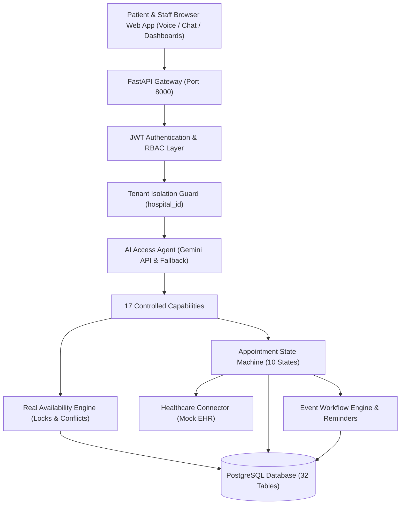

# Autonomous Multi-Hospital Patient Intake, Scheduling & Pre-Visit Voice Agent

[](https://www.python.org/)
[](https://fastapi.tiangolo.com/)
[-D71F00.svg?logo=sqlalchemy&logoColor=white)](https://www.sqlalchemy.org/)
[-success.svg)](backend/app/tests)
[](LICENSE)

An enterprise-grade, multi-tenant healthcare access and operations platform prototype built strictly to the Product Requirements Document (PRD).

The system automates hospital onboarding, doctor availability scheduling, patient intake, conversational AI access (text and voice), EHR integration with two-phase verification and timeout failure recovery, post-booking pre-visit questionnaires, event-driven workflows, and role-specific dashboards with end-to-end auditability.

---

## 📑 Table of Contents

- [Quick Start (Local & Docker)](#-quick-start-local--docker)
- [Demo Credentials](#-demo-credentials)
- [2-Minute Failure & Safe Recovery Demo](#-2-minute-failure--safe-recovery-demonstration)
- [High-Level Architecture](#-high-level-architecture)
- [AI Safety Boundaries & Emergency Protocol](#-ai-safety-boundaries--emergency-protocol)
- [Automated Test Suite](#-automated-test-suite)
- [Detailed Documentation & PDF Deliverables](#-detailed-documentation--pdf-deliverables)
- [Repository Structure](#-repository-structure)
- [Technology Stack](#-technology-stack)

---

## 🚀 Quick Start (Local & Docker)

### Option 1: Run with Docker Compose (Recommended)

```bash
# 1. Clone or navigate to the repository
cd "Hospital-Management"

# 2. Build and launch all services (PostgreSQL, Redis, Backend, Mock EHR, Frontend)
docker compose up --build
```

The application will automatically apply Alembic migrations, seed the database with demo hospitals and doctors, and start serving at:
- **Web Dashboard**: [http://localhost:8000/](http://localhost:8000/)
- **Interactive OpenAPI Documentation**: [http://localhost:8000/docs](http://localhost:8000/docs)
- **Alternative ReDoc**: [http://localhost:8000/redoc](http://localhost:8000/redoc)

---

### Option 2: Run Locally (Python 3.12+)

```bash
# 1. Navigate to the backend directory
cd backend

# 2. Install dependencies
pip install -r requirements.txt

# 3. Apply database migrations
alembic upgrade head

# 4. Seed demo hospitals, doctors, schedules, and accounts
python -m app.db.seed

# 5. Launch the FastAPI server
uvicorn app.main:app --reload --host 0.0.0.0 --port 8000
```

Open [http://localhost:8000/](http://localhost:8000/) in your web browser.

---

## 🔑 Demo Credentials

All seeded accounts share the default password: **`Password123!`**

| Role | Email | Purpose / Primary Workflows |
| :--- | :--- | :--- |
| **Platform Admin** | `platform.admin@healthcare.local` | Hospital approvals, reconciliation manager, audit timeline, global analytics |
| **Hospital Admin** | `admin@metrogeneral.org` | Metro General Hospital config, doctor management, calendar schedules |
| **Doctor** | `dr.rao@metrogeneral.org` | Dr. Marcus Rao (Orthopedics): Daily patient queue, pre-visit questionnaire reviews |
| **Patient** | `jane.doe@example.com` | Jane Doe: Conversational AI intake, voice assistant, slot booking, intake form |

---

## ⚡ 2-Minute Failure & Safe Recovery Demonstration

The evaluator can intentionally trigger and observe the failure recovery sequence in under 2 minutes:

1. Open [http://localhost:8000/](http://localhost:8000/) as **Patient**.
2. Click the red button: **`⚡ Simulate EHR Timeout (2 Min Demo)`**.
3. **What Happens Under the Hood**:
   - The platform arms the Mock EHR connector with the `UNKNOWN_OUTCOME` simulation mode.
   - The booking request is dispatched with a unique `idempotency_key`.
   - The Mock EHR persists the record externally but simulates a network drop, returning an `EHRTimeoutException`.
   - The system intercepts the timeout and enters the **`SYNCHRONIZATION_PENDING`** state.
   - The recovery engine queries the Mock EHR using the idempotency key.
   - The external record is discovered and synchronized to **`CONFIRMED`**.
   - A `ReconciliationRecord` is created, audit logged, and automatically marked **`RESOLVED`**.
   - **Duplicate prevention**: Attempting to book the same slot again is strictly rejected.

---

## 🏗️ High-Level Architecture



---

## 🛡️ AI Safety Boundaries & Emergency Protocol

The AI patient access assistant operates strictly within administrative boundaries:

- **No Clinical Diagnosis**: Does not diagnose or prescribe treatment.
- **Emergency Triage**: If the patient mentions acute medical emergencies (e.g. *"I have severe chest pain and shortness of breath"*), the assistant triggers an immediate emergency escalation advising the patient to call 911 or visit the nearest emergency room.
- **Anti-Hallucination**: The AI model **never has direct SQL access** and cannot invent appointment slots. All availability is calculated dynamically by the database-backed `SchedulingService`.

---

## 🧪 Automated Test Suite

Run the complete test suite with `pytest`:

```bash
cd backend
pytest -v
```

### Test Coverage Highlights:

- `test_tenant_isolation.py`: Verifies Hospital A cannot view or modify Hospital B doctors/appointments.
- `test_scheduling.py`: Real availability slot calculation, duration slicing, blocked slots, and conflict detection.
- `test_appointment_state_machine.py`: Legal vs illegal state transitions.
- `test_verification_and_recovery.py`: Verifies timeout → unknown outcome → external query → safe recovery without duplicates.
- `test_ai_safety_and_capabilities.py`: Emergency medical triage escalation and controlled capability execution.
- `test_acceptance_workflow.py`: End-to-end acceptance scenario matching Section 45.

---

## 📚 Detailed Documentation & PDF Deliverables

Complete engineering specifications and submission-ready PDFs are available in the [docs/](docs/) directory:

| Document | Description | Format |
| :--- | :--- | :--- |
| [Architecture Documentation](docs/architecture.md) | Component topology, multi-tenancy, and scheduling algorithms | [Markdown](docs/architecture.md) \| [PDF](docs/Architecture_Documentation.pdf) |
| [AI Safety & Capabilities](docs/ai.md) | Dual-provider design, 17 tools catalog, and clinical guardrails | [Markdown](docs/ai.md) \| [PDF](docs/AI_Tools_and_Usage_Documentation.pdf) |
| [AI Prompts Used](docs/ai.md) | Complete unredacted system prompts, emergency triggers & schemas | [Markdown](docs/ai.md) \| [PDF](docs/AI_Prompts_Used.pdf) |
| [Failure Recovery & Reconciliation](docs/failure-recovery.md) | EHR timeout handling, idempotency, and reconciliation state machine | [Markdown](docs/failure-recovery.md) |
| [Healthcare Connector & Mock EHR](docs/ehr-integration.md) | Two-phase verification pattern and fault simulation modes | [Markdown](docs/ehr-integration.md) |
| [Security & Multi-Tenancy](docs/security.md) | Tenant isolation, RBAC matrix, and audit logging | [Markdown](docs/security.md) |
| [REST API Reference](docs/api.md) | Key endpoints, standard headers, and error schema | [Markdown](docs/api.md) |

---

## 📂 Repository Structure

```
Hospital-Management/
├── backend/
│   ├── app/
│   │   ├── main.py                     # FastAPI app factory, CORS, exception handlers, static UI mount
│   │   ├── core/                       # Pydantic Settings, JWT security, structured logging, exceptions
│   │   ├── db/
│   │   │   ├── base.py                 # SQLAlchemy Base, TimestampMixin, TenantMixin
│   │   │   ├── database.py             # Async engine, sessionmaker, and get_db dependency
│   │   │   ├── models/                 # 32 explicit SQLAlchemy models
│   │   │   └── seed.py                 # Seed script for 2 hospitals, 4 doctors, schedules, questionnaires
│   │   ├── api/                        # REST API routers (auth, hospitals, doctors, scheduling, etc.)
│   │   ├── schemas/                    # Pydantic v2 schemas
│   │   ├── services/                   # Business logic layer (scheduling, appointments, reconciliation)
│   │   ├── ai/                         # GeminiProvider, FallbackProvider, 17 Capabilities, Prompts
│   │   ├── integrations/               # HealthcareConnector interface & MockEHRConnector
│   │   ├── static/                     # Full-stack SPA (HTML, CSS, JS with Web Speech API)
│   │   └── tests/                      # Automated unit, integration, and E2E test suites
│   ├── alembic/                        # Alembic async migration files
│   ├── alembic.ini
│   ├── requirements.txt
│   ├── Dockerfile
│   └── pytest.ini
├── docs/                               # Detailed technical documentation & generated PDFs
│   ├── architecture.md
│   ├── ai.md
│   ├── security.md
│   ├── ehr-integration.md
│   ├── failure-recovery.md
│   ├── api.md
│   ├── Architecture_Documentation.pdf
│   ├── AI_Tools_and_Usage_Documentation.pdf
│   └── AI_Prompts_Used.pdf
├── docker-compose.yml
├── render.yaml
├── Procfile
├── .python-version
├── requirements.txt
├── .env.example
└── README.md
```

---

## 📋 Technology Stack

- **Backend**: Python 3.12+, FastAPI, Uvicorn, SQLAlchemy 2.0 (asyncio), Alembic, Pydantic v2, Pydantic Settings, PyJWT, Bcrypt, HTTPX, Pytest, Pytest-Asyncio.
- **AI**: Google GenAI Python SDK (`google-genai`), Gemini 2.5 Flash, structured tool calling, deterministic fallback provider.
- **Frontend**: Lightweight modern healthcare SaaS interface with Web Speech API for real-time voice intake.
- **Database**: PostgreSQL 16 (with async SQLite support for zero-setup local testing).
- **Integration**: Decoupled `HealthcareConnector` interface and `MockEHRConnector` with fault injection controls.
- **Infrastructure**: Docker, Docker Compose, Render, Redis.