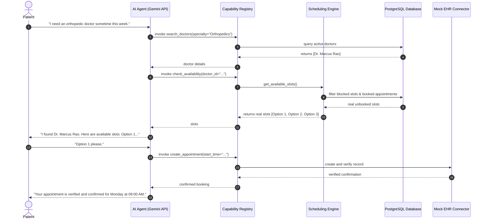

# AI Administrative Patient Access Agent & Controlled Capabilities

[← Back to Repository README](../README.md)

---

## 1. Safety Boundaries & Operational Scope

The AI assistant operates strictly as an **administrative healthcare access coordinator**. It adheres to the following non-negotiable safety guardrails:

> [!CAUTION]
> **Strict Clinical Guardrails:**
> - The AI **NEVER** diagnoses medical conditions.
> - The AI **NEVER** prescribes medications or suggests dosages.
> - The AI **NEVER** recommends clinical treatments or medication changes.
> - The AI **NEVER** performs independent clinical triage.
> - **Emergency Protocol**: If acute emergency symptoms are expressed (e.g. *"I have severe chest pain and shortness of breath"*), the assistant immediately halts routine scheduling, provides an urgent emergency alert to call 911 or visit the nearest ER, and marks the interaction as an emergency escalation in audit logs.

---

## 2. Anti-Hallucination Availability Engine

The AI model is never allowed to fabricate appointment slots, hospital names, or doctor identities.

- **No Direct SQL Access**: The AI model interacts exclusively with registered, typed capability tools.
- **Dynamic Slot Calculation**: Availability is determined dynamically via the `check_availability` capability, which queries the database-backed `SchedulingService`.
- **EHR Verification**: No appointment is marked confirmed to the patient until external EHR verification succeeds.

---

## 3. Controlled Capability Architecture

---

## 4. The 17 Registered Capabilities Catalog

| Capability | Domain | Description | Input Schema |
| :--- | :--- | :--- | :--- |
| `search_hospitals` | Discovery | Search approved hospitals by name/city | `SearchHospitalsInput` |
| `search_doctors` | Discovery | Find doctors by medical specialty or name | `SearchDoctorsInput` |
| `check_availability` | Scheduling | Query genuine database slots for doctor | `CheckAvailabilityInput` |
| `lookup_patient` | Identity | Resolve patient identity and demographics | `LookupPatientInput` |
| `get_appointment` | Appointments | Retrieve appointment status and history | `GetAppointmentInput` |
| `create_appointment` | Appointments | Book appointment with two-phase EHR verification | `CreateAppointmentInput` |
| `reschedule_appointment`| Appointments | Reschedule to a new real slot with EHR update | `RescheduleAppointmentInput` |
| `cancel_appointment` | Appointments | Cancel booking and release slot | `CancelAppointmentInput` |
| `get_questionnaire` | Clinical Intake | Fetch pre-visit intake form assigned to appointment | `GetQuestionnaireInput` |
| `submit_questionnaire`| Clinical Intake | Submit structured patient intake answers | `SubmitQuestionnaireInput` |
| `send_notification` | Alerts | Dispatch in-app, SMS, or email alert | `SendNotificationInput` |
| `start_workflow` | Automations | Trigger background operational workflow | `StartWorkflowInput` |
| `get_context` | Session State | Inspect conversation context state | `GetContextInput` |
| `update_preferences` | Preferences | Update communication preferences | `UpdatePreferencesInput` |
| `verify_external_appointment` | EHR Sync | Verify appointment existence in external EHR | `VerifyExternalAppointmentInput` |
| `synchronize_state` | EHR Sync | Synchronize internal status with external EHR | `SynchronizeStateInput` |
| `transfer_to_human` | Escalation | Escalate request or emergency to clinical staff | `TransferToHumanInput` |

---

## 5. Download Official PDF Specifications

- 📄 **[AI_Tools_and_Usage_Documentation.pdf](AI_Tools_and_Usage_Documentation.pdf)**
- 📄 **[AI_Prompts_Used.pdf](AI_Prompts_Used.pdf)**
