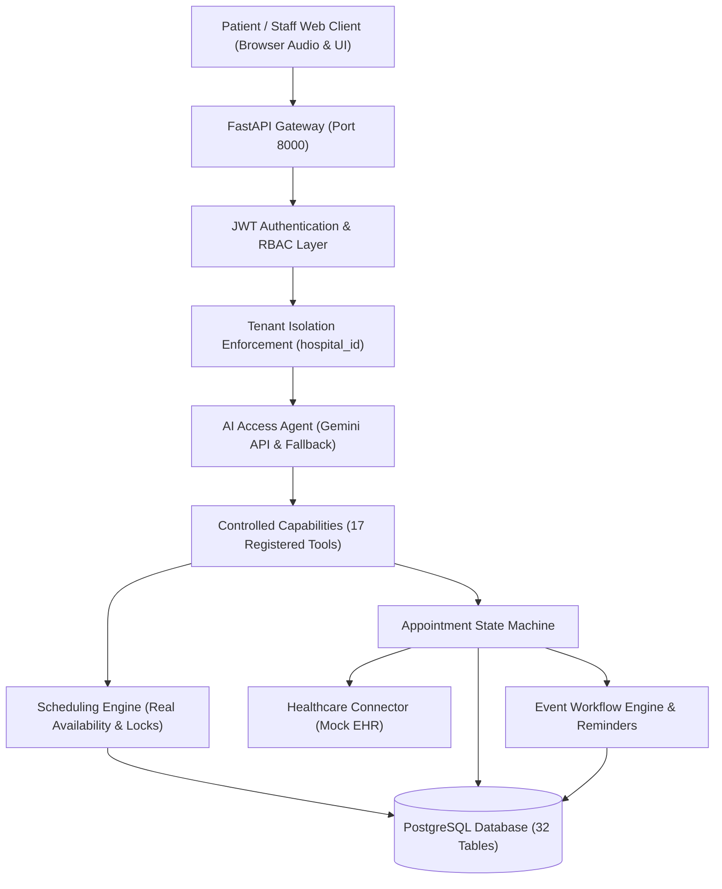
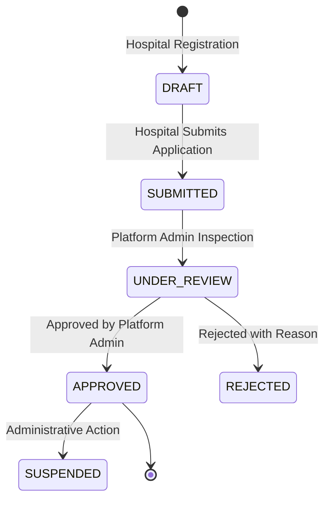

# High-Level Architecture Documentation

[← Back to Repository README](../README.md)

---

## 1. System Overview

The **Autonomous Multi-Hospital Patient Intake, Scheduling & Pre-Visit Voice Agent** is a multi-tenant healthcare operations platform built with FastAPI, PostgreSQL, SQLAlchemy 2.0, Pydantic v2, and the Google Gemini API.



---

## 2. Multi-Tenant Hospital Isolation

Every hospital functions as an isolated tenant. No hospital staff or doctor can view, query, or mutate resources belonging to another hospital.

```mermaid
graph LR
    subgraph TenantA["Tenant: Metro General Hospital"]
        DocA["Doctors (Dr. Rao, Dr. Chen)"]
        CalA["Calendars & Slots"]
        ApptA["Appointments & Questionnaires"]
    end

    subgraph TenantB["Tenant: Apex Healthcare Pavilion"]
        DocB["Doctors (Dr. Patel, Dr. Wilson)"]
        CalB["Calendars & Slots"]
        ApptB["Appointments & Questionnaires"]
    end

    StaffA["Metro Hospital Admin"] -.->|Authorized| TenantA
    StaffA -.-x|Blocked (403 TENANT_ACCESS_DENIED)| TenantB

    PlatformAdmin["Platform Super Admin"] -->|Supervision & Approval| TenantA
    PlatformAdmin -->|Supervision & Approval| TenantB
```

---

## 3. Hospital Onboarding Lifecycle



---

## 4. Key Architectural Subsystems

### 1. Scheduling Engine (`SchedulingService`)
- Calculates real bookable slots from doctor weekly working hours (`Availability`).
- Filters out doctor leaves and emergencies (`BlockedSlot`).
- Filters out already scheduled active bookings (`Appointment`).
- Performs atomic revalidation immediately prior to reservation to prevent double-booking.

### 2. Healthcare Connector (`MockEHRConnector`)
- Implements `HealthcareConnector` interface.
- Decoupled from core business services so it can be swapped with Epic, Cerner, or FHIR adapters.
- Provides runtime simulation modes (`NORMAL`, `TIMEOUT`, `UNKNOWN_OUTCOME`, etc.) for operational resilience demonstrations.

### 3. Two-Phase Verification & Reconciliation (`ReconciliationService`)
- Every booking invokes an external create, followed by an independent external verification call.
- If a timeout occurs, the system moves to `UNKNOWN_OUTCOME` and issues an idempotency query to discover actual external state before safely recovering or flagging human escalation.

---

## 5. Download Official PDF Specification

You can download the publication-grade PDF version of this document:  
📄 **[Architecture_Documentation.pdf](Architecture_Documentation.pdf)**
