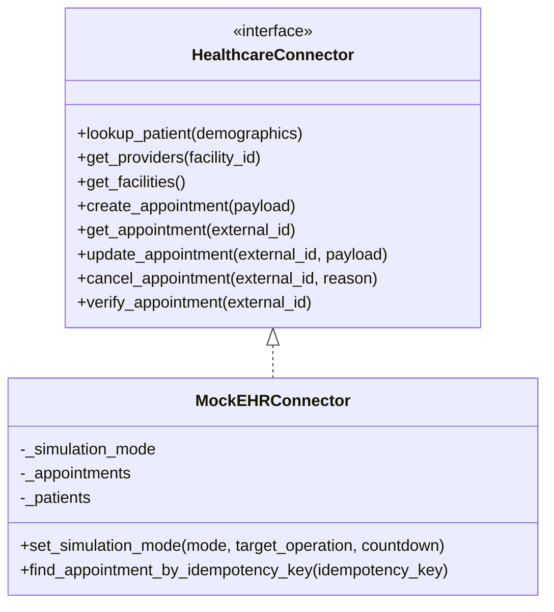
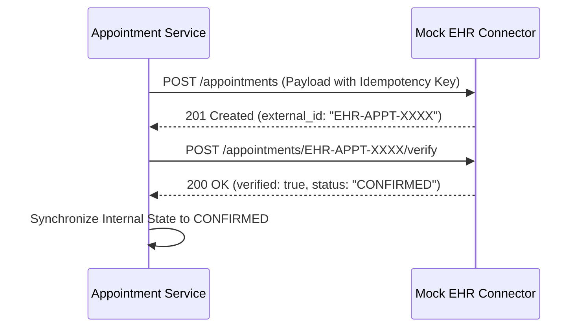

# Healthcare System & Mock EHR Integration

[← Back to Repository README](../README.md)

---

## 1. Connector Abstraction

To ensure modularity and readiness for enterprise EHR systems (Epic, Cerner, FHIR APIs), all EHR interactions are governed by the `HealthcareConnector` abstract interface.

---

## 2. Two-Phase Verification Pattern

External systems must never be trusted based on an initial HTTP response alone. The platform enforces two-phase verification:

---

## 3. Mock EHR Simulation Modes

The Mock EHR supports real-time fault injection for testing and resilience demonstrations:

| Mode | Behavior | Purpose |
| :--- | :--- | :--- |
| `NORMAL` | Standard immediate 201/200 confirmation | Happy path testing |
| `TIMEOUT` | Injects latency and raises `EHRTimeoutException` | Tests client timeout handling |
| `UNKNOWN_OUTCOME` | Saves record externally but drops client response | Demonstrates idempotency verification & safe recovery |
| `AUTH_ERROR` | Returns HTTP 401 Unauthorized | Validates authentication alert workflows |
| `SLOT_CONFLICT` | Returns HTTP 409 Conflict | Tests external provider conflict detection |
