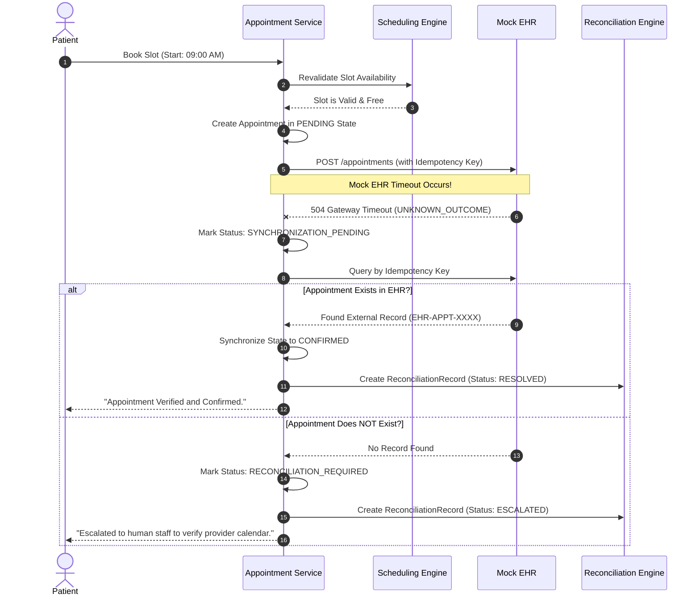
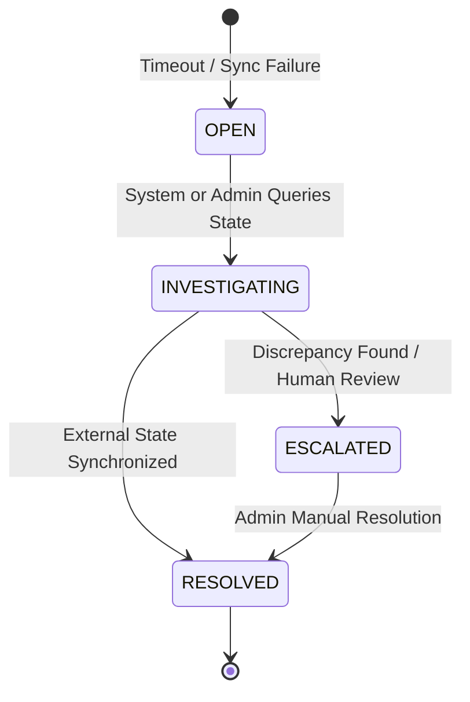

# Failure Recovery & Reconciliation State Machine

[← Back to Repository README](../README.md)

---

## 1. Mandatory Failure Scenario

Healthcare scheduling platforms frequently encounter upstream network timeouts or dropped connections during external EHR writes. Blind retries risk duplicate appointments, double billing, and provider calendar corruption.

This platform implements the **Timeout Recovery State Machine**:

---

## 2. Preventing Duplicate Bookings

1. **Idempotency Keying**: Every booking attempt generates a unique UUID-based `idempotency_key`. The external query searches specifically by this key.
2. **Pessimistic Revalidation**: Before confirming any booking or retry, `revalidate_slot_availability()` verifies no active booking occupies the requested time window.
3. **Audit Records**: Every step logs an `AuditEvent` with `correlation_id` and `operation_id`.

---

## 3. Reconciliation Record Lifecycle

