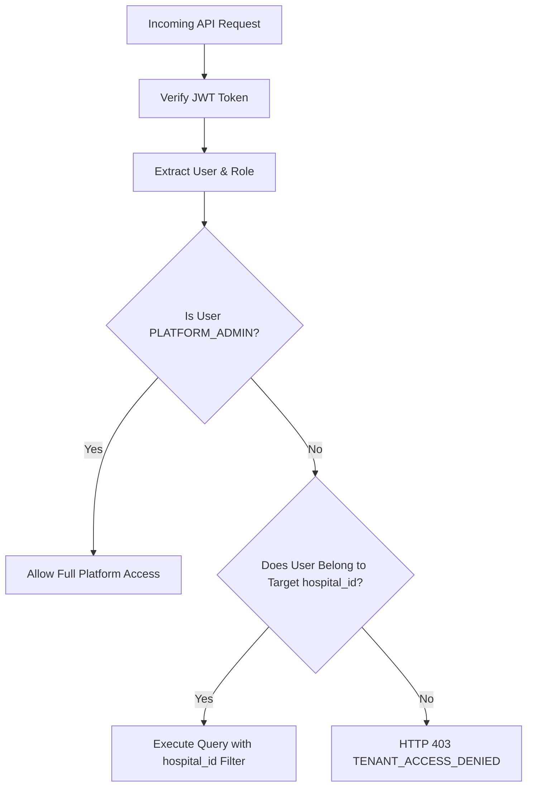

# Security & Multi-Tenancy Architecture

## 1. Multi-Tenant Hospital Isolation

Multi-tenancy is enforced at the database, service, and API dependency levels:
1. **Model Layer**: All tenant-owned tables extend `TenantMixin`, requiring an indexed foreign key to `hospitals.id`.
2. **Database Queries**: All queries filter by `hospital_id` obtained from the authenticated user's profile.
3. **API Dependency Layer**: `verify_tenant_access(hospital_id, current_user)` strictly rejects cross-tenant requests with HTTP 403 `TENANT_ACCESS_DENIED`.

---

## 2. Role-Based Access Control (RBAC)

| Role | Scope | Permitted Operations |
| :--- | :--- | :--- |
| **PLATFORM_ADMIN** | Global (All Tenants) | Approve/reject hospital applications, view cross-tenant analytics, resolve reconciliation incidents, monitor audit trail. |
| **HOSPITAL_ADMIN** | Tenant (`hospital_id`) | Configure hospital profile, invite doctors, configure working hours and blocked slots, manage questionnaires, view tenant appointments. |
| **DOCTOR** | Provider & Tenant | View daily patient queue, manage calendar availability, review authorized pre-visit patient questionnaires. |
| **PATIENT** | Individual & Public | Search approved hospital directory, check real doctor availability, interact with AI intake assistant, complete questionnaires. |

---

## 3. Privacy & HIPAA Alignment

- **Correlation ID Tracking**: Every request receives `X-Correlation-ID` and `X-Operation-ID`.
- **Privacy-Aware Logging**: Log entries record operational metadata, status codes, and correlation IDs without dumping unencrypted patient medical notes into standard stdout logs.
- **Secure Password Hashing**: Passwords hashed with `bcrypt` using cryptographic salt rounds.
- **Zero Hardcoded Secrets**: Secrets are sourced from environment variables via Pydantic Settings.
